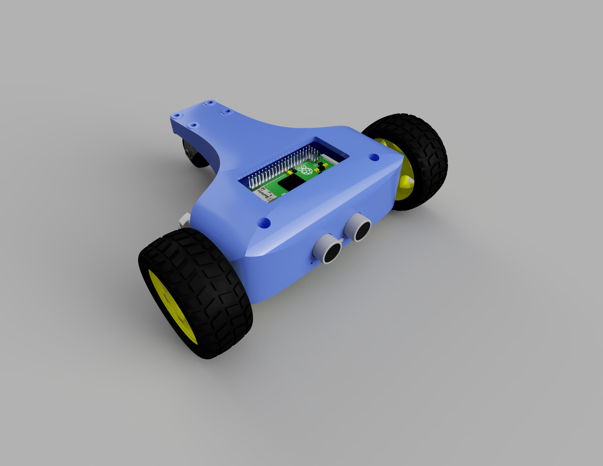
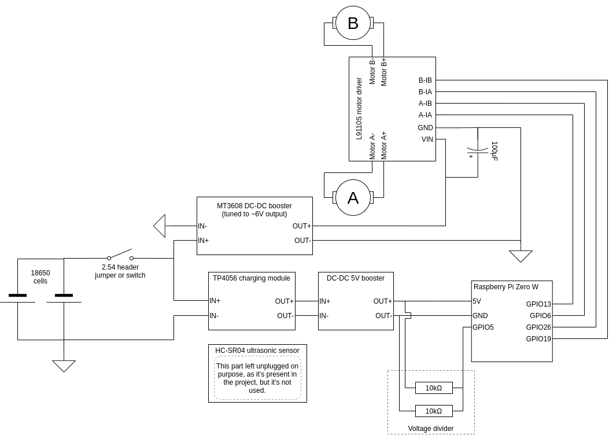
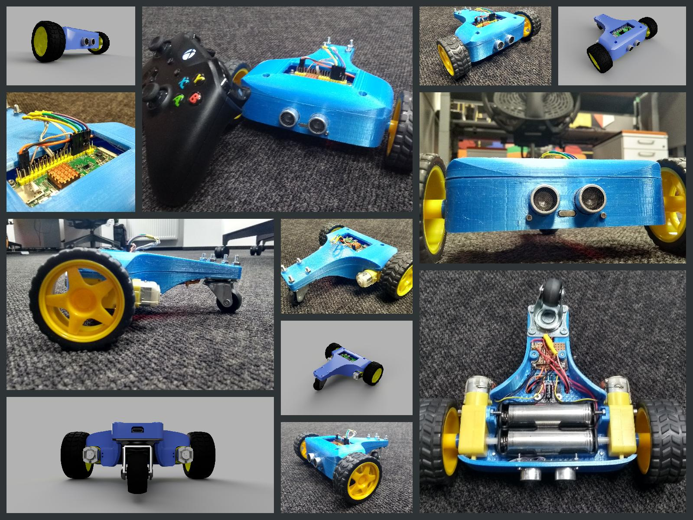

# Tadpole

# About
Tadpole is a three-wheeled vehicle, driven by two indepedent front motors. My goal was to have a go at designing and integrating a system that consists of different software and hardware components.

A particularly interesting part of the design process, was implementing the motor controller logic, which handles conversion of user input, into motor speed and direction. The usage of two, independently driven front motors, enables the vehicle to not only turn while moving forwards/backwards, but also to spin in place. The calculated throttle (by default) is mapped to a 3rd order polynomial curve. This solution makes small movements result in subtle speed changes, but as the gamepad stick deviates further from its origin, the speed changes are more noticeable and aggressive. These characteristics make Tadpole particularly agile and precise.

## Hardware
Apart from te 3D printed stuff, the hardware parts are commonly available and can be cheaply ordered from online electronics shops. 

- Raspberry Pi Zero W
- 2x [6V DC motor](https://www.google.com/search?q=6v+dc+motor+robot+yellow).
- 2x 18650 battery.
- TP4056 battery charging and overdischarge protection module.
- DC-DC 5V booster module (RPi power source).
- DC-DC switching booster module (motor power source). 
- L9110S H-bridge motor driver.
- HC-SR04 ultrasonic sensor.
- Rotating furniture wheel.
- 3D printed frame.
- Xbox One S wireless gamepad.
- Some wires, soldering tools, screwdrivers, etc..

### 3D printing BOM
| Part ID              | Amount (pcs)  |
| --------------------:|:--------------|
| cover_back.stl       | 1             |
| cover_top.stl        | 1             |
| frame_main.stl       | 1             |
| mount_rpi.stl        | 1             |

## Software
- [Raspbian Buster Lite](https://www.raspberrypi.org/downloads/raspbian/)
- [xpadneo](https://github.com/atar-axis/xpadneo) - Advanced Linux Driver for Xbox One Wireless Controller
- Python 3.6+ environment
- (optional) [Fusion 360, for tweaking the existing 3D project.](https://www.autodesk.com/products/fusion-360/overview)

## 3D Models
3D models are available in STL format under the [/models](./models) directory.
- Dummy models [/models/dummy](./models/dummy)
- Tadpole parts models [/models/tadpole](./models/tadpole)

## Circuit schematics
Circuit schematics in different file formats are located in the [/schematics](./schematics) directory.

## Images

Rendered images as well as real life photos can be found in the [images/](./images) directory.  
 

